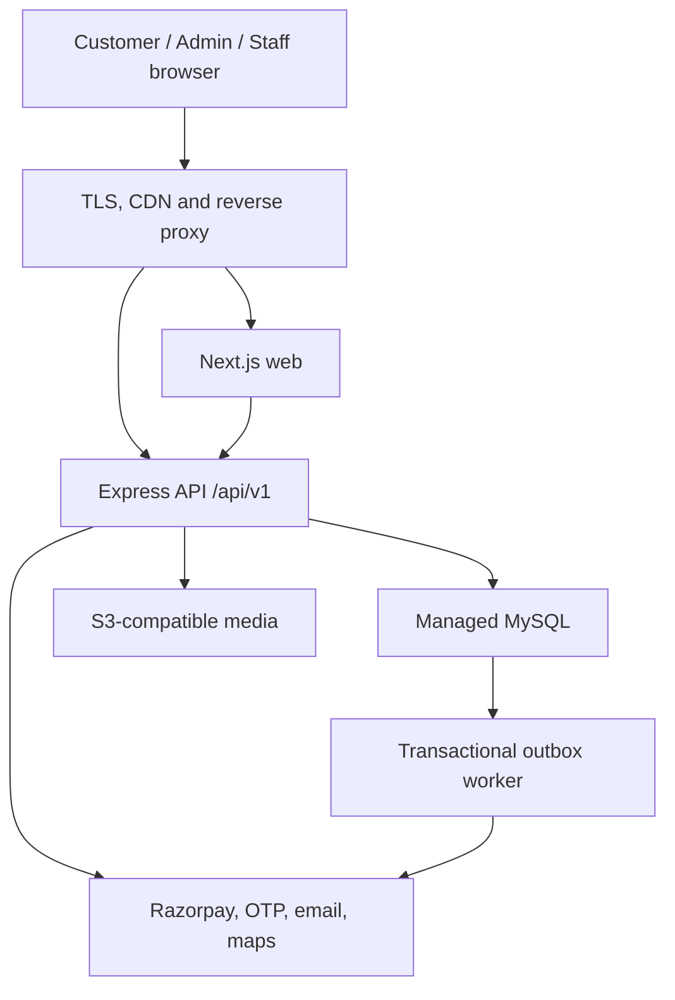

# Replica Home Salon - Admin-First Engineering Blueprint

## Outcome

Build one maintainable, SEO-friendly and scalable web platform for three account types:

- Customer
- Staff / salon professional
- Admin-related users

Implementation starts with the complete administration platform. The database and API boundaries must still anticipate the customer booking journey and staff job workflow so that later phases do not require a rewrite.

## Source-of-truth decisions

The following files were reviewed:

- `Replica_Home_Salon_Statement_of_Work (1).pdf`
- `salon_replica_ux_prototype_responsive(2).html`

Precedence:

1. The signed SOW controls commercial scope, exclusions and accepted modules.
2. The responsive HTML prototype controls the visual direction and interaction baseline for in-scope screens.
3. This blueprint clarifies the implementation architecture and admin-first sequence.

Important scope handling:

- Implement `SALARIED` and `GIG` as staff engagement classifications.
- Do not implement salary, commission, incentives, deductions, payout or payroll calculations in the current SOW scope.
- Do not implement customer-delay timers, grace-period fees, per-minute charges, waivers or disputes.
- Do not implement a production generative-AI assistant. A contextual help panel and WhatsApp support launcher are allowed.
- Do not promise browser tracking while the staff browser is closed or background execution is restricted.

## Recommended technology stack

| Layer | Recommended choice | Why it fits this application |
| --- | --- | --- |
| Runtime | Node.js 24 LTS | Stable LTS runtime shared by the web, API and worker processes. |
| Repository | pnpm workspace with Turborepo | One lockfile, shared packages and independent deployment of web/API/worker without creating separate repositories. |
| Public site and portals | Next.js 16.3 App Router, React 19, strict TypeScript | Server rendering and static generation for SEO; route groups for public, admin, customer and staff surfaces. Use the latest patched stable releases within these major versions. |
| UI system | Tailwind CSS 4, shadcn/ui, Radix primitives, Lucide icons | Fast consistent UI development, accessible primitives, theme tokens and low custom-component maintenance. |
| Forms and validation | React Hook Form plus shared Zod schemas | Accessible forms, predictable errors and validation reuse between UI and API. |
| Admin server state | TanStack Query | Cache, retry, invalidation and mutations for data-heavy admin screens. Do not use it for server-rendered public content that Next.js can fetch directly. |
| Admin tables | TanStack Table | Sorting, filters, pagination, column visibility and responsive table control without a heavy commercial grid. |
| API | Express 5, strict TypeScript, REST under `/api/v1` | Matches the SOW while keeping integration webhooks and business logic separate from page rendering. |
| API contract | Zod request/response contracts plus generated OpenAPI | One source of truth for validation, client types and API documentation. |
| Authentication | Better Auth with Prisma/MySQL adapter | Self-hosted email/password, reset flows, sessions, OTP/phone extensions and 2FA support without per-user identity-provider charges. |
| Authorization | Application-owned dynamic RBAC tables and server policies | Admin-created roles and module/action permissions require database-driven authorization, not UI-only role checks. |
| Database | Managed MySQL LTS plus Prisma ORM and committed migrations | Matches the SOW, supports transactions and provides typed queries and versioned schema changes. |
| Background work | MySQL transactional outbox plus a small worker process | Reliable notifications and webhook follow-up without paying for Redis at launch. Add Redis/BullMQ only when measured volume justifies it. |
| Media | S3-compatible object storage via an adapter | Direct/presigned uploads, CDN delivery and provider portability. Do not store images in MySQL. |
| Rich content | TipTap editor with server-side sanitization | Lets admins manage Privacy Policy and Terms content while preventing unsafe rendered HTML. |
| Charts | Recharts for the limited KPI/trend set | Small learning curve and sufficient for the SOW's operational dashboards. |
| Logging/monitoring | Pino structured logs, request IDs, health endpoints, error monitoring adapter | Production diagnostics without coupling the code to one monitoring vendor. |
| Tests | Vitest, Supertest, Playwright and axe accessibility checks | Unit, API integration, end-to-end, responsive and accessibility coverage. |
| Deployment | Docker images behind Caddy or Nginx | Portable deployment on a low-cost VPS first, then separable containers when traffic grows. |

### Deliberately excluded at launch

- Kubernetes
- Microservices
- GraphQL
- Event streaming
- Redis merely for sessions or queues
- Redux for ordinary page/server state
- Elasticsearch for the initial catalogue
- A second database

These would increase cost and operational burden before the traffic or product complexity requires them.

## Architecture



Launch with a modular monolith. The web, API and worker remain separately runnable and stateless, but they share one repository, one database model and shared contracts. This is cheaper and easier to operate than microservices while preserving a clean scaling path.

## Suggested repository layout

```text
apps/
  web/                    Next.js public site and role-aware portals
  api/                    Express REST API and provider webhooks
  worker/                 outbox and scheduled-job processor
packages/
  db/                     Prisma schema, migrations, seed and client
  contracts/              Zod schemas and generated API types
  auth/                   Better Auth config and authorization primitives
  ui/                     shared design-system components and tokens
  config/                 shared TypeScript, ESLint and environment schemas
docs/
  reference/              immutable copies of SOW and approved prototype
  ARCHITECTURE.md
  DATABASE.md
  SECURITY.md
  SCOPE_MATRIX.md
  ADMIN_IMPLEMENTATION_PLAN.md
AGENTS.md
docker-compose.yml
.env.example
```

## Identity and access model

### Account types

- `CUSTOMER`: OTP login in the customer phase; can access only their own profile, addresses, bookings, invoices and support data.
- `STAFF`: password or approved OTP login; can access their own availability, assigned jobs and required job actions.
- `ADMIN`: invite-only email/password login with RBAC. No public admin registration.

`accountType` identifies the product surface. Roles and permissions define what the user can do inside that surface.

### Initial roles

| Role | Intended access |
| --- | --- |
| `SUPER_ADMIN` | All modules, role administration and protected system settings. Seeded securely; cannot be casually deleted or demoted. |
| `ADMIN` | Broad operational access except protected super-admin actions. |
| `OPERATIONS_MANAGER` | Dashboard, bookings, customers, staff assignments, contact/support and operational reports. |
| `CATALOG_MANAGER` | Categories, services, media and public content. |
| `FINANCE_MANAGER` | Payment state, refunds/status records, settlements, invoices and finance exports. |
| `SUPPORT_AGENT` | Customer/contact context and permitted booking-support actions; no destructive finance or role changes. |
| `STAFF` | Own staff profile, availability and assigned jobs only. |
| `CUSTOMER` | Own customer records only. |

Admin users may create additional roles from the permitted resource/action matrix.

### Permission model

Resources:

`dashboard`, `bookings`, `customers`, `staff`, `categories`, `services`, `payments`, `refunds`, `invoices`, `reports`, `notifications`, `roles`, `admin_users`, `content`, `contacts`, `audit_logs`, `settings`

Actions:

`view`, `create`, `update`, `approve`, `delete`, `assign`, `export`, `publish`, `refund`, `manage_permissions`

Rules:

- Enforce permission and record ownership in the API for every protected operation.
- Navigation visibility is convenience only; hiding a menu item is never authorization.
- Default-deny all protected resources and actions.
- Log sensitive and destructive actions in an immutable audit trail.
- Prefer archive/disable over hard delete for business records.

## Admin-first product scope

### 1. Admin authentication and security

Routes:

- `/admin/login`
- `/admin/forgot-password`
- `/admin/reset-password`
- `/admin/change-password`
- `/admin/security/sessions`
- `/admin/security/two-factor`

Requirements:

- Invite-only admin activation.
- Generic forgot-password response to prevent email enumeration.
- Short-lived, hashed, single-use reset tokens.
- Revoke other sessions after password reset.
- Change password requires an active session and current-password verification.
- TOTP 2FA mandatory for super admins and configurable/encouraged for other admin roles.
- Rate-limit login, OTP, reset and invitation endpoints.
- Secure, `HttpOnly`, `Secure`, `SameSite` cookies; rotate session identifiers after authentication and sensitive account changes.
- Account status: invited, active, suspended, disabled.
- Session list and remote revocation.
- Audit login, failure, reset, change-password, 2FA and role-change events without logging secrets.

### 2. Enterprise admin shell

- Responsive collapsible sidebar and mobile drawer.
- Top bar with page title, global search, notifications, theme switch and account menu.
- Light, dark and system themes using semantic tokens.
- Lavender-led palette derived from the prototype, with WCAG 2.2 AA contrast.
- Breadcrumbs, permission-aware navigation and consistent page actions.
- Tables support search, filters, sorting, column chooser, export and 10/25/50/100 pagination.
- Desktop tables become usable mobile cards or controlled horizontal tables below 768 px.
- Complete loading, empty, error, success and confirmation states.
- Keyboard navigation, visible focus, accessible labels and reduced-motion handling.

### 3. Dashboard

- Booking summary
- Revenue/payment summary
- Active and available staff
- Average rating
- Live operations and active bookings
- Booking/revenue trend
- Permission-aware exports and date filters

Until the booking and payment modules have data, widgets must render honest empty states, not fake production figures.

### 4. Admin users, roles and permissions

- Invite/create admin user
- Activate, suspend and disable
- Assign one or more roles
- Create/edit/archive custom roles
- Module/action permission matrix
- Prevent privilege escalation
- Prevent removal of the last active super admin
- View/revoke sessions where permitted
- Full audit history

### 5. Categories, subcategories and services

Category model:

- Name, slug, description, image, SEO title/description, status and sort order.
- Optional `parentId` for subcategories.
- Enforce a maximum depth of one in phase 1: category -> optional subcategory.
- Block cycles, duplicate sibling slugs and unsafe deletion when active services depend on a category.

Service model:

- Name, slug, short and full description
- Category/subcategory
- Images and display ordering
- Duration
- Price and optional compare-at/discount display
- GST/tax configuration
- Inclusions and exclusions
- Optional add-ons/options from the SOW
- Eligible staff skills
- Serviceability zones
- Status, featured flag and sort order
- SEO metadata and structured-data fields

Use integer paise or an exact decimal representation for money; never binary floating-point.

### 6. Staff management

- Staff identity and employee ID
- Contact information and emergency contact where approved
- `SALARIED` or `GIG` engagement classification
- Skills, service eligibility and zones
- Availability and schedules
- Documents with type, expiry and verification status
- Status: invited, active, unavailable, suspended, offboarded
- Ratings and job-performance summary when real booking data exists
- Staff login invitation and session controls

Do not calculate salary, commission, incentives, deductions, earnings or payouts in the current scope. Preserve clean extension points for a later approved payroll module.

### 7. Content management

- Privacy Policy
- Terms and Conditions
- Optional cancellation/refund policy if the client supplies approved content
- Draft, preview, publish and rollback to a prior revision
- SEO title/description and canonical slug
- Sanitized rich-text storage and safe server rendering
- Published-by and published-at audit fields

Legal text must be supplied/approved by the client; the application must not invent legal policy.

### 8. Contact list and support intake

- Contact submissions from the public contact form
- Search, filters, date range, source and status
- Status: new, in progress, resolved, spam
- Assign to an authorized admin/support user
- Internal notes and activity history
- CSV export permission
- Data retention controls and PII-safe logs

### 9. Remaining SOW admin modules

- Bookings: create/search/filter, assign/reassign, status, reschedule/cancel/complete, payment state and map/status context.
- Customers: profile, contacts, addresses, booking history, spend, ratings, support context and status/segment.
- Payments/invoices: payment state, basic refund/status recording, settlements, invoice/receipt output and Razorpay webhook reconciliation.
- Reports: booking, revenue, customer, staff and service performance with export.
- Notifications: event-driven templates/rules and delivery logs for configured providers.

These modules are part of the admin-first release even though customer and staff interfaces are built later.

## Database domain plan

| Domain | Core entities |
| --- | --- |
| Authentication | `User`, Better Auth account/session/verification tables, `AdminInvitation`, `SecurityEvent` |
| Authorization | `Role`, `Permission`, `UserRole`, `RolePermission` |
| Audit | `AuditLog` with actor, action, resource, before/after metadata, request ID, IP hash and timestamp |
| Catalogue | `Category`, `Service`, `ServiceImage`, `ServiceAddon`, `Skill`, `ServiceSkill`, `Zone`, `ServiceZone` |
| Staff | `StaffProfile`, `StaffSkill`, `StaffZone`, `StaffDocument`, `StaffSchedule`, `AvailabilityException` |
| Customer | `CustomerProfile`, `Address`, `ConsentRecord` |
| Booking | `Booking`, `BookingItem`, `BookingStatusHistory`, `StaffAssignment`, `ServiceStartOtp`, `Review` |
| Commerce | `Coupon`, `CouponRedemption`, `Payment`, `RefundRecord`, `Invoice` |
| Content | `ContentPage`, `ContentRevision`, `MediaAsset` |
| Support | `ContactSubmission`, `ContactActivity`, `SupportTicket`, `TicketMessage` |
| Notifications | `NotificationTemplate`, `NotificationRule`, `NotificationDelivery`, `OutboxEvent` |
| Operations | `AppSetting`, `IdempotencyKey`, `WebhookEvent` |

Database rules:

- Use UTC in storage and `Asia/Kolkata` for business display unless the business setting changes.
- Add `createdAt`, `updatedAt` and appropriate actor fields.
- Add optimistic concurrency/version fields where concurrent admin edits matter.
- Add indexes for every common filter, foreign key and uniqueness rule.
- Use transactions for booking assignment, payment reconciliation, role changes and publish operations.
- Preserve webhook event IDs and idempotency keys to prevent duplicate payment/notification processing.
- Never expose sequential internal identifiers where an opaque public ID is safer.
- Use soft deletion/archive status for categories, services, users and business records unless retention rules explicitly permit hard deletion.

## SEO plan for the later customer site

Public SEO routes:

- `/`
- `/services`
- `/services/[serviceSlug]`
- `/categories/[categorySlug]`
- `/privacy-policy`
- `/terms-and-conditions`
- `/contact`

Requirements:

- Server Components by default; client components only for actual interaction.
- Static generation or revalidated server rendering for catalogue/content pages.
- Per-page title, description, canonical URL and Open Graph data.
- `sitemap.xml`, `robots.txt` and stable slugs with redirects after slug changes.
- JSON-LD where accurate: `LocalBusiness`, `Service`, `BreadcrumbList`, `FAQPage` and aggregate rating only from genuine data.
- Semantic HTML, accessible headings, descriptive image alt text and optimized responsive images.
- Noindex all `/admin`, `/staff`, customer-account, preview and authentication routes.
- Revalidate affected public pages when admins publish content or catalogue changes.

## Low-cost deployment path

### Launch topology

- One small Linux application host running Dockerized Next.js, Express API and worker processes.
- A managed MySQL instance with automated backups and point-in-time recovery where available.
- S3-compatible object storage for media.
- Caddy or Nginx for TLS termination and same-origin `/api` routing.
- A CDN/DNS provider in front of the public site.
- Provider adapters for email/OTP, Razorpay and maps so client-selected accounts can change without rewriting business logic.

Do not place production MySQL and the only application copy on an unmanaged single disk merely to reduce the first invoice. Database backup and restore capability is part of maintainability.

### Scale only when metrics require it

1. Split web, API and worker onto separate containers/hosts.
2. Horizontally scale stateless web/API processes.
3. Add Redis-backed queues and distributed cache when outbox latency or repeated reads justify it.
4. Add read replicas/search infrastructure only after real bottlenecks are measured.

## Admin-first implementation sequence

1. Repository foundation, `AGENTS.md`, architecture/security/database docs, CI and environment validation.
2. Prisma foundation and complete forward-compatible domain schema.
3. Authentication: admin login, invitation, forgot/reset/change password, sessions and 2FA.
4. Dynamic RBAC and audit logging.
5. Responsive admin shell and design system with light/dark/system themes.
6. Admin users, roles and permissions.
7. Categories, subcategories, services, skills, zones and media.
8. Staff management with salaried/gig classification only.
9. Privacy/Terms content management and contact list.
10. Customers and bookings operations.
11. Payments/invoices, reports and notifications.
12. Security review, responsive/accessibility QA, integration tests and deployment documentation.

## Definition of done for the admin-first release

- All admin routes require a valid session and server-enforced permission.
- Login, invite, forgot/reset/change password, session revocation and 2FA flows pass automated tests.
- Admin CRUD persists to MySQL; no module is a visual-only mock.
- Tables, filters, pagination, exports and mobile layouts are usable at 390, 768, 1024 and 1440 px.
- Light/dark/system themes work without contrast failures or hydration flicker.
- API validation, error shapes, audit logs and idempotency are consistent.
- Unit, API integration and critical Playwright tests pass.
- Lint, formatting, type-check and production builds pass.
- `.env.example`, migrations, seeds, README, API docs and deployment/restore notes are complete.
- No secrets, raw payment data, OTPs, reset tokens or sensitive PII appear in source control or logs.
- Payroll, delay-charge and generative-AI functionality is absent from the current implementation.

## Current official references

- [Node.js release status](https://nodejs.org/en/about/previous-releases)
- [Next.js 16.3](https://nextjs.org/blog/next-16-3)
- [Next.js metadata and Open Graph](https://nextjs.org/docs/app/getting-started/metadata-and-og-images)
- [Express production security](https://expressjs.com/en/advanced/best-practice-security/)
- [Better Auth installation](https://better-auth.com/docs/installation)
- [Better Auth email/password and resets](https://better-auth.com/docs/authentication/email-password)
- [Better Auth admin access control](https://better-auth.com/docs/plugins/admin)
- [Prisma with MySQL](https://www.prisma.io/docs/prisma-orm/quickstart/mysql)
- [OWASP Authentication Cheat Sheet](https://cheatsheetseries.owasp.org/cheatsheets/Authentication_Cheat_Sheet.html)
- [Codex project instructions with AGENTS.md](https://learn.chatgpt.com/docs/agent-configuration/agents-md)

