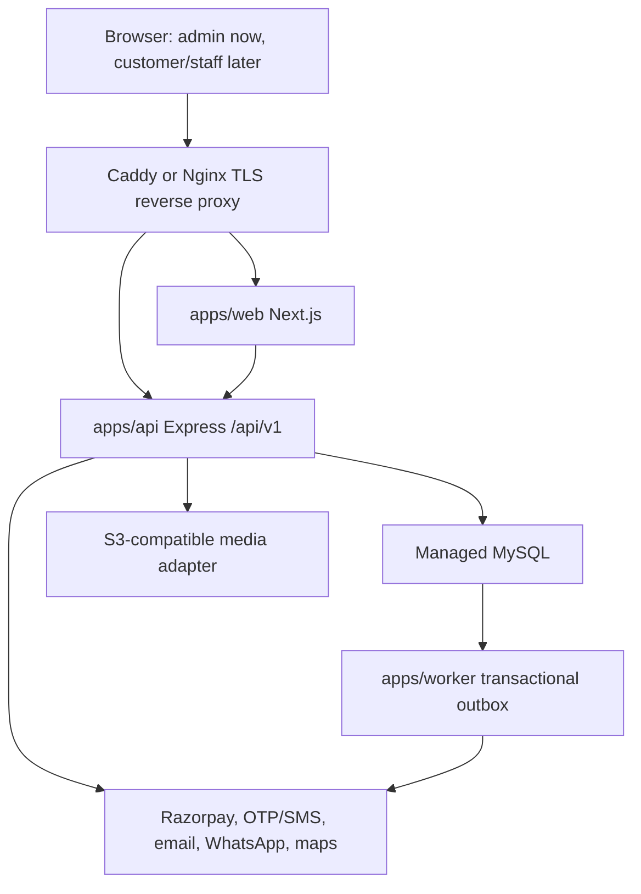

# Replica Home Salon Architecture

## Summary

Replica Home Salon uses a pnpm/Turborepo modular monolith. The web, API and worker run as separate stateless processes from one repository and share typed contracts, auth policy code and Prisma database access.



## Repository Layout

```text
apps/web       Next.js 16 App Router UI, starting with admin routes
apps/api       Express 5 REST API, webhooks, policies and domain services
apps/worker    Outbox and background delivery processor
packages/db    Prisma schema, migrations, seed and client export
packages/contracts Zod request/response contracts and OpenAPI source
packages/auth  Better Auth setup, RBAC helpers and policy primitives
packages/ui    Shared admin design-system components and theme tokens
packages/config Shared environment, TypeScript and runtime config
docs           Scope, architecture, database, security and delivery docs
```

## Runtime and Stack

- Node.js 24 LTS is the target runtime. The current local shell reports Node 22.18.0, so full verification must wait for Node 24.
- Next.js 16.3.1, React 19.2.8 and React DOM 19.2.8 are the current stable major-version choices verified against npm on 2026-08-16.
- Express 5.2.1 is the API framework.
- Prisma 7.9.1 with MySQL is the database layer.
- Tailwind CSS 4, shadcn/ui-compatible composition, Radix primitives and Lucide icons form the admin UI system.
- Better Auth handles auth/session primitives; application-owned RBAC handles business authorization.
- Zod validates environment variables, API inputs, API outputs and forms.
- Vitest, Supertest, Playwright and axe cover unit, API, browser and accessibility checks.

## Boundaries

- Route handlers and React components call API clients; business rules live in API/domain services.
- Provider integrations sit behind adapters so production credentials can be supplied later without changing domain logic.
- Shared Zod contracts define request/response shapes and are used to generate OpenAPI.
- The API enforces authentication, account status, RBAC permission and object-level access. UI visibility is never authorization.
- The worker reads outbox rows written in the same MySQL transaction as the business change.

## Deployment Topology

- Caddy or Nginx terminates TLS and routes `/api/*` to Express and other traffic to Next.js.
- Web, API and worker are independent Docker images/processes.
- MySQL must be managed or otherwise backed up; production must not rely on an unprotected local application disk.
- Media uses S3-compatible storage with presigned upload/download flows.
- All services are stateless except MySQL and object storage.

## Development Topology

- `docker-compose.yml` provides local MySQL and Mailpit-style development dependencies.
- `.env.example` lists required names only, never production values.
- Provider adapters expose explicit development/test modes instead of production-looking fake behavior.
