# Database Design

## Principles

- MySQL with Prisma is the primary datastore.
- Use opaque public IDs for externally referenced entities.
- Store timestamps in UTC; display through the configured business timezone.
- Store money as integer paise or exact decimal, never JavaScript floating point.
- Prefer archive/disable/status fields over hard delete for business records.
- Use Prisma transactions for multi-record invariants.
- Preserve idempotency keys and webhook event IDs for replay safety.

## Mermaid ERD

```mermaid
erDiagram
    User ||--o{ UserRole : has
    Role ||--o{ UserRole : assigned
    Role ||--o{ RolePermission : grants
    Permission ||--o{ RolePermission : included
    User ||--o{ AdminInvitation : invites
    User ||--o{ SecurityEvent : records
    User ||--o{ AuditLog : acts

    User ||--o| CustomerProfile : customer
    User ||--o| StaffProfile : staff
    CustomerProfile ||--o{ Address : saves
    StaffProfile ||--o{ StaffSkill : has
    Skill ||--o{ StaffSkill : maps
    StaffProfile ||--o{ StaffZone : serves
    Zone ||--o{ StaffZone : maps
    StaffProfile ||--o{ StaffDocument : uploads
    StaffProfile ||--o{ StaffSchedule : schedules
    StaffProfile ||--o{ AvailabilityException : exceptions

    Category ||--o{ Category : parent_child
    Category ||--o{ Service : contains
    Service ||--o{ ServiceImage : images
    Service ||--o{ ServiceAddon : addons
    Service ||--o{ ServiceSkill : needs
    Skill ||--o{ ServiceSkill : qualifies
    Service ||--o{ ServiceZone : available
    Zone ||--o{ ServiceZone : maps

    CustomerProfile ||--o{ Booking : books
    Booking ||--o{ BookingItem : includes
    Service ||--o{ BookingItem : selected
    Booking ||--o{ BookingStatusHistory : tracks
    Booking ||--o{ StaffAssignment : assigns
    StaffProfile ||--o{ StaffAssignment : receives
    Booking ||--o{ ServiceStartOtp : verifies
    Booking ||--o{ Review : reviewed

    Booking ||--o{ Payment : paid_by
    Payment ||--o{ RefundRecord : refunds
    Payment ||--o| Invoice : invoices
    Coupon ||--o{ CouponRedemption : redeemed
    CustomerProfile ||--o{ CouponRedemption : redeems

    ContentPage ||--o{ ContentRevision : versions
    MediaAsset ||--o{ ServiceImage : used_by
    ContactSubmission ||--o{ ContactActivity : activity
    SupportTicket ||--o{ TicketMessage : messages

    NotificationTemplate ||--o{ NotificationRule : uses
    NotificationRule ||--o{ NotificationDelivery : sends
    OutboxEvent ||--o{ NotificationDelivery : dispatches
    WebhookEvent ||--o{ Payment : reconciles
```

## Core Field Decisions

| Entity                | Key Decisions                                                                                                                       |
| --------------------- | ----------------------------------------------------------------------------------------------------------------------------------- |
| `User`                | One identity table with `accountType` values `CUSTOMER`, `STAFF`, `ADMIN`; status supports invited, active, suspended and disabled. |
| `Role` / `Permission` | System roles are protected; custom roles are allowed for authorized admins. Permissions are resource/action pairs.                  |
| `AuditLog`            | Append-only with actor, action, resource type/id, safe before/after summary, request ID and privacy-safe context.                   |
| `Category`            | Optional `parentId`; enforce max depth one and duplicate sibling slug rejection in service/domain logic plus supporting indexes.    |
| `Service`             | Price in paise, optional compare-at price in paise, GST basis points/decimal field, publish/archive status and SEO fields.          |
| `StaffProfile`        | `engagementType` is only `SALARIED` or `GIG`; no payroll, commission or payout fields in current scope.                             |
| `Booking`             | Explicit status state machine, status history and assignment records; assignment changes run transactionally.                       |
| `Payment`             | Provider references, state, amount in paise, idempotency key and no raw card data.                                                  |
| `WebhookEvent`        | Provider event ID, payload hash, processing status, attempts and replay-safe linkage.                                               |
| `ContentPage`         | Page type, slug, status, SEO metadata and published revision pointer; legal text must be client supplied or labeled draft.          |
| `OutboxEvent`         | Transactional event queue with status, attempts, available-at and last-error summary.                                               |

## Initial Enumerations

- `AccountType`: `CUSTOMER`, `STAFF`, `ADMIN`
- `UserStatus`: `INVITED`, `ACTIVE`, `SUSPENDED`, `DISABLED`
- `StaffEngagementType`: `SALARIED`, `GIG`
- `PublishStatus`: `DRAFT`, `PUBLISHED`, `ARCHIVED`
- `BookingStatus`: `DRAFT`, `CONFIRMED`, `ASSIGNMENT_PENDING`, `ASSIGNED`, `ACCEPTED`, `EN_ROUTE`, `ARRIVED`, `IN_SERVICE`, `COMPLETED`, `CANCELLED`
- `PaymentStatus`: `PENDING`, `AUTHORIZED`, `CAPTURED`, `FAILED`, `REFUNDED`, `PARTIALLY_REFUNDED`
- `ContactStatus`: `NEW`, `IN_PROGRESS`, `RESOLVED`, `SPAM`
- `OutboxStatus`: `PENDING`, `PROCESSING`, `SENT`, `FAILED`, `DEAD`
